# System Binary Proxy Execution

**MITRE ATT&CK**: T1218.011 – System Binary Proxy Execution | Tactic: Stealth

## Intro
T1218.011 is a Signed Binary Proxy Execution technique in which adversaries abuse the legitimate Windows rundll32.exe utility to execute malicious DLLs, scripts, or other payloads indirectly. In this lab, multiple Atomic Red Team tests were simulated covering DLL execution, VBScript/JavaScript, .cpl and .hta files, INF files, ordinal-based execution, and other proxy-execution methods. Telemetry was collected across process creation, command-line, image loading, and script activity, producing detections for suspicious rundll32.exe execution and its associated payloads.


## Detection Queries & Evidence

Event ID 1: Sysmon Process Created
```spl
index=main
source="XmlWinEventLog:Microsoft-Windows-Sysmon/Operational"
EventCode=1
process_name="rundll32.exe"
(process="*vbscript:*" OR process="*mshtml,RunHTMLApplication*" OR process="*mshtml,#*")
| table _time EventCode host user parent_process_name process_name process
| sort - _time
```
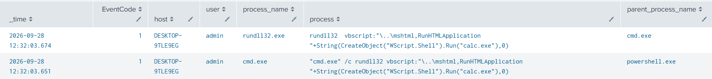
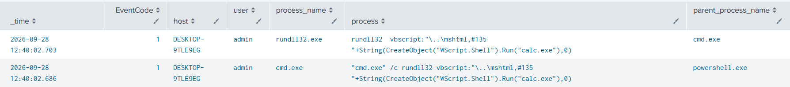

Event ID 1: Sysmon Process Created
```spl
index=main
source="XmlWinEventLog:Microsoft-Windows-Sysmon/Operational"
EventCode=1
process_name="rundll32.exe"
(process="*advpack.dll,LaunchINFSection*" OR process="*advpack.dll,RegisterOCX*" OR process="*advpack.dll,DelNodeRunDLL32*"
 OR process="*setupapi.dll,InstallHinfSection*" OR process="*syssetup.dll,SetupInfObjectInstallAction*")
| regex process!="(?i)\x5c(windows\x5cinf|driverstore|program files( \(x86\))?)\x5c"
| table _time EventCode host user parent_process_name process_name process
| sort - _time
```
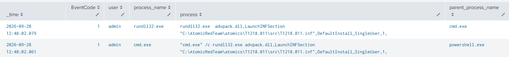
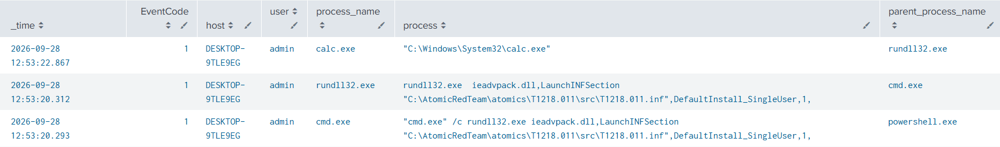
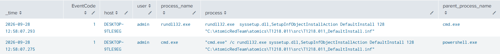
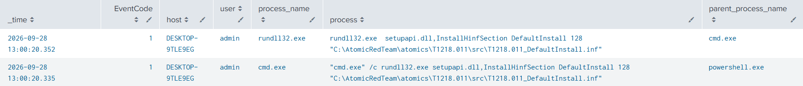

Event ID 1: Sysmon Process Created
```spl
index=main
source="XmlWinEventLog:Microsoft-Windows-Sysmon/Operational"
EventCode=1
process_name="rundll32.exe"
(process="*url.dll,FileProtocolHandler*" OR process="*url.dll,OpenURL*" OR process="*ieframe.dll,OpenURL*")
| regex process!="(?i)(fileprotocolhandler|openurl)\s+\x22?(https?|mailto|ftp):"
| table _time EventCode host user parent_process_name process_name process
| sort - _time
```
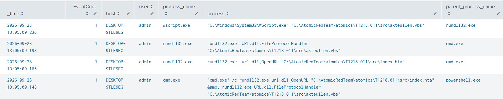
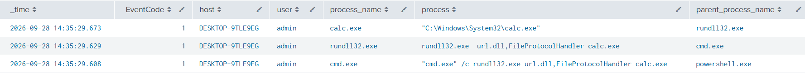 

Event ID 1: Sysmon Process Created
```spl
index=main
source="XmlWinEventLog:Microsoft-Windows-Sysmon/Operational"
EventCode=1
process_name="rundll32.exe"
(process="*pcwutl.dll,LaunchApplication*" OR process="*zipfldr.dll,RouteTheCall*" OR process="*desk.cpl,InstallScreenSaver*")
| table _time EventCode host user parent_process_name process_name process
| sort - _time
```
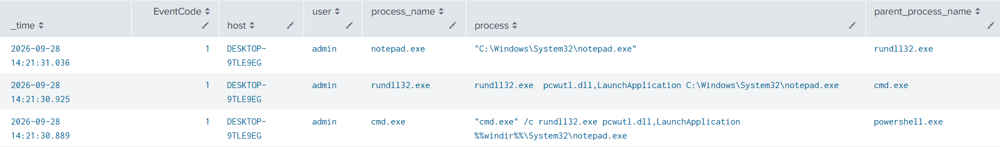
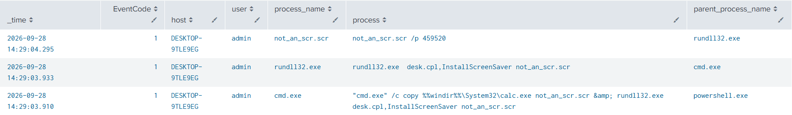 
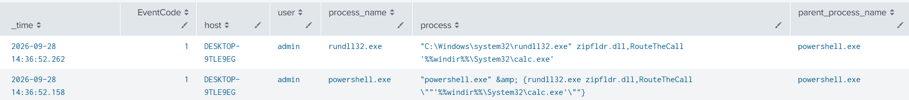 

Event ID 1: Sysmon Process Created
```spl
index=main
source="XmlWinEventLog:Microsoft-Windows-Sysmon/Operational"
EventCode=1
process_name="rundll32.exe"
(process="*.png*" OR process="*.txt*" OR process="*.tmp*" OR process="*.init*" OR process="*Control_RunDLL*.dll*" OR process="*.dll*,#*")
NOT process="*mshtml*"
| table _time EventCode host user parent_process_name process_name process
| sort - _time
```
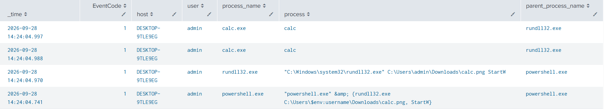
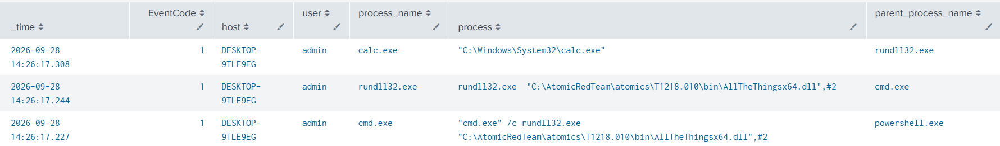 
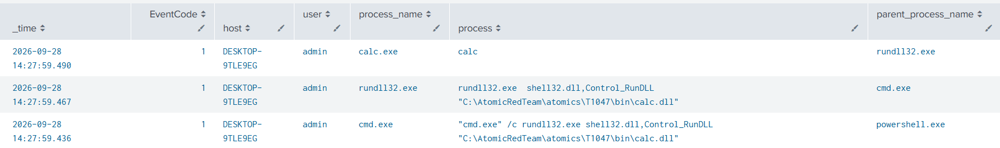 
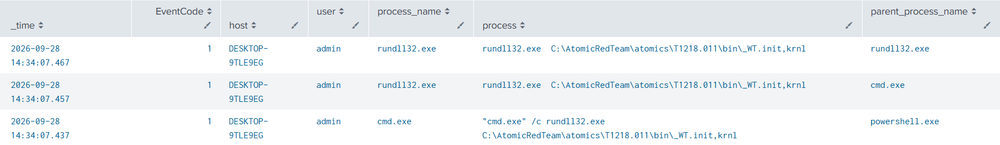 

## References
- MITRE ATT&CK: https://attack.mitre.org/techniques/T1218/
- Atomic Red Team: https://www.atomicredteam.io/docs/atomics/T1218.011