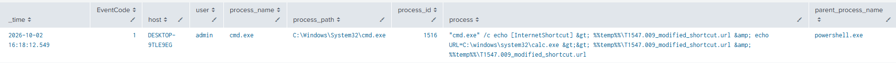
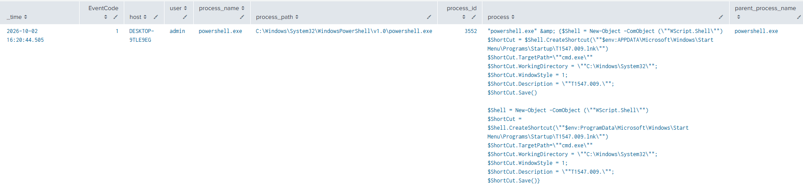
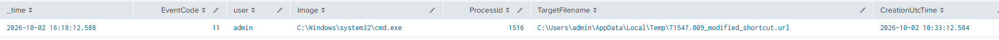
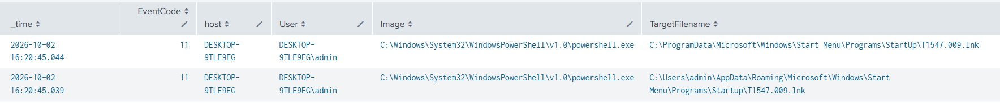

# Shortcut Modification

**MITRE ATT&CK**: T1547 – Boot or Logon Autostart Execution | Tactic: Persistence, Privilege Escalation

## Intro
T1547.009 is a Boot or Logon Autostart Execution technique in which adversaries create or modify shortcuts, such as .lnk or .url files, to execute malicious programs during system startup or user logon. Adversaries may place shortcuts in Startup folders or modify existing shortcuts to redirect execution to a malicious program. In this lab, Atomic Red Team tests were simulated covering shortcut modification and creation of shortcuts in Startup folders, with telemetry collected across file, shortcut, and process execution activity.


## Detection Queries & Evidence

Event ID 1: Sysmon Process Creation
```spl
  index=main
  source="XmlWinEventLog:Microsoft-Windows-Sysmon/Operational"
  EventCode=1
  process_name="cmd.exe"
  | search process="*.url*"
  | table _time EventCode user process_name process parent_process_name 
  | sort - _time
```


Event ID 1: Sysmon Process Creation
```spl
  index=main
  source="XmlWinEventLog:Microsoft-Windows-Sysmon/Operational"
  EventCode=1
  process_name="powershell.exe"
  | search process="*CreateShortcut*" OR process="*.lnk*"
  | table _time EventCode user process_name process parent_process_name 
  | sort - _time
```


Event ID 11: Sysmon File Create
```spl
index=main
source="XmlWinEventLog:Microsoft-Windows-Sysmon/Operational"
EventCode=11
TargetFilename="*.url"
| table _time host user Image ProcessId TargetFilename CreationUtcTime
| sort - _time
```


Event ID 11: Sysmon File Create
```spl
index=main
source="XmlWinEventLog:Microsoft-Windows-Sysmon/Operational"
EventCode=11
TargetFilename="*.lnk"
| search TargetFilename="*\\Startup\\*"
| table _time host user Image ProcessId TargetFilename CreationUtcTime
| sort - _time
```


## References
- MITRE ATT&CK: https://attack.mitre.org/techniques/T1547/009/
- Atomic Red Team: https://www.atomicredteam.io/docs/atomics/T1547.009