# Registry Run Keys / Startup Folder

**MITRE ATT&CK**: T1547.001 – Boot or Logon Autostart Execution | Tactic: Persistence, Privilege Escalation

## Intro
T1547.001 is a Boot or Logon Autostart Execution technique in which adversaries establish persistence by placing executables or scripts in Windows Registry Run/RunOnce keys or Startup folders, causing them to execute automatically when a user logs on. In this lab, multiple Atomic Red Team tests were simulated covering Registry Run/RunOnce and Startup Folder persistence, with telemetry collected across registry, file, process, and PowerShell activity. The investigation produced multiple detections, including registry value modification, Startup-folder file creation, process execution during logon, PowerShell/script execution, shortcut (.lnk) creation, and changes to User Shell Folders.


## Detection Queries & Evidence

Event ID 13: Sysmon Registry Value Set
```spl
  index=main 
  source="XmlWinEventLog:Microsoft-Windows-Sysmon/Operational"
  EventCode=13
  (TargetObject="*\\CurrentVersion\\Run\\*" OR TargetObject="*\\CurrentVersion\\RunOnce\\*" OR TargetObject="*\\CurrentVersion\\RunOnceEx\\*")
  | table _time EventCode host user process_name process_id TargetObject registry_key_name registry_value_name registry_value_data
  | sort - _time
```
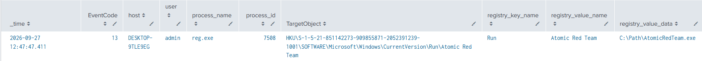
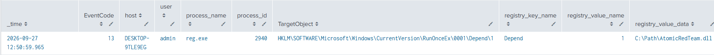
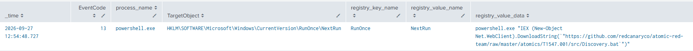
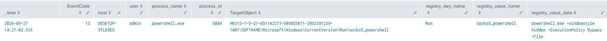
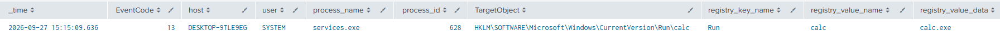
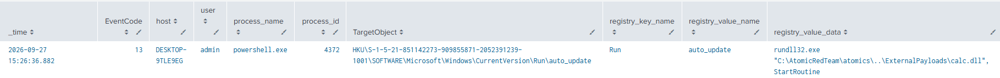

```spl
  index=main 
  source="XmlWinEventLog:Microsoft-Windows-Sysmon/Operational"
  EventCode=13
  TargetObject="*\\CLSID\\*\\shell\\*\\command\\*"
  | table _time EventCode host user process_name process_id TargetObject registry_key_name registry_value_name registry_value_data
  | sort - _time
```
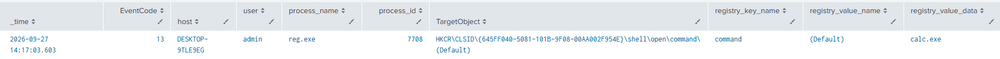

Event ID 13: Sysmon Registry Value Set
```spl
  index=main 
  source="XmlWinEventLog:Microsoft-Windows-Sysmon/Operational"
  EventCode=13
  (TargetObject="*\\Explorer\\User Shell Folders\\Startup" OR TargetObject="*\\Explorer\\User Shell Folders\\Common Startup",)
  | table _time EventCode host user process_name process_id TargetObject registry_key_name registry_value_name registry_value_data
  | sort - _time
```
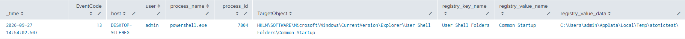

Event ID 13: Sysmon Registry Value Set
```spl
  index=main 
  source="XmlWinEventLog:Microsoft-Windows-Sysmon/Operational"
  EventCode=13
  TargetObject="*\\Policies\\Explorer\\Run\\*"
  | table _time EventCode host user process_name process_id TargetObject registry_key_name registry_value_name registry_value_data
  | sort - _time
```
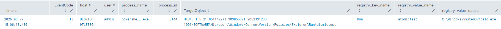

Event ID 13: Sysmon Registry Value Set
```spl
  index=main 
  source="XmlWinEventLog:Microsoft-Windows-Sysmon/Operational"
  EventCode=13
  (TargetObject="*\\Winlogon\\Userinit" OR TargetObject="*\\Winlogon\\Shell")
  | table _time EventCode host user process_name process_id TargetObject registry_key_name registry_value_name registry_value_data
  | sort - _time
```
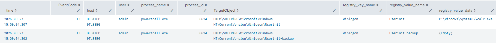
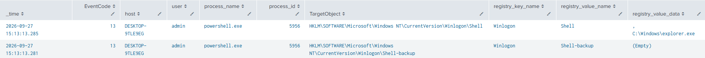

Event ID 13: Sysmon Registry Value Set
```spl
  index=main 
  source="XmlWinEventLog:Microsoft-Windows-Sysmon/Operational"
  EventCode=13
  TargetObject="*\\Session Manager\\BootExecute"
  | table _time EventCode host user process_name process_id TargetObject registry_key_name registry_value_name registry_value_data
  | sort - _time
```
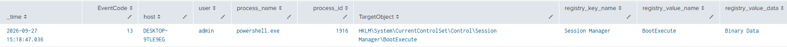

Event ID 13: Sysmon Registry Value Set
```spl
  index=main 
  source="XmlWinEventLog:Microsoft-Windows-Sysmon/Operational"
  EventCode=13
  TargetObject="*\\Wds\\rdpwd\\StartupPrograms"
  | table _time EventCode host user process_name process_id TargetObject registry_key_name registry_value_name registry_value_data
  | sort - _time
```
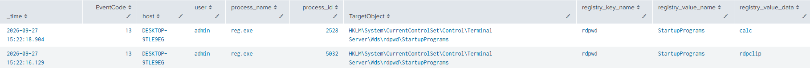

Event ID 13: Sysmon Registry Value Set
```spl
  index=main 
  source="XmlWinEventLog:Microsoft-Windows-Sysmon/Operational"
  EventCode=13
  TargetObject="*\\Control\\BootVerificationProgram\\ImagePath"
  | table _time EventCode host user process_name process_id TargetObject registry_key_name registry_value_name registry_value_data
  | sort - _time
```
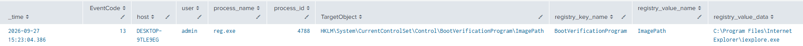

Event ID 13: Sysmon Registry Value Set
```spl
  index=main 
  source="XmlWinEventLog:Microsoft-Windows-Sysmon/Operational"
  EventCode=13
  TargetObject="*\\Directory\\Background\\shell\\*\\command\\*"
  | table _time EventCode host user process_name process_id TargetObject registry_key_name registry_value_name registry_value_data
  | sort - _time
```
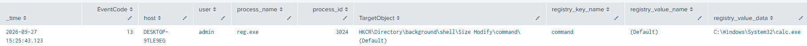

Event ID 11: Sysmon File Created
```spl
  index=main
  EventCode=11 
  TargetFilename="*\\Start Menu\\Programs\\Startup\\*"
  | table _time host user Image ProcessId TargetFilename CreationUtcTime 
  | sort - _time
```
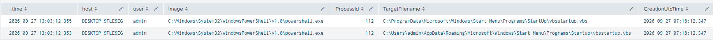
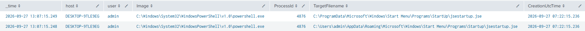
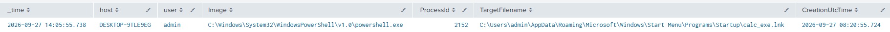


## References
- MITRE ATT&CK: https://attack.mitre.org/techniques/T1547/001/
- Atomic Red Team: https://www.atomicredteam.io/docs/atomics/T1547.001