# Clear Windows Event Logs

**MITRE ATT&CK**: T1685 – Disable or Modify Tools | Tactic: Defense Impairment

## Intro
T1685.005 is a Defense Evasion technique in which adversaries clear or modify Windows Event Logs to remove evidence of malicious activity and hinder investigation. This can be performed using utilities such as wevtutil, PowerShell commands, VBA/WMI, or by directly deleting .evtx log files. In this lab, multiple Atomic Red Team tests were simulated covering Windows Event Log clearing through wevtutil, PowerShell, VBA/WMI, and ransomware-style iterative log clearing.


## Detection Queries & Evidence

Event ID 1: Sysmon Process Creation
```spl
index=main
source="XmlWinEventLog:Microsoft-Windows-Sysmon/Operational"
EventCode=1
process_name="wevtutil.exe"
| search process="* cl *"
| table _time EventCode user process_name process parent_process_name
| sort - _time
```
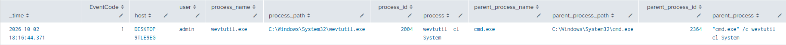
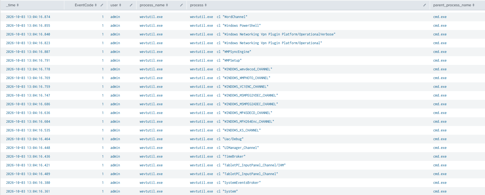
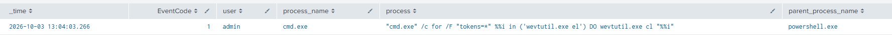

Event ID 1: Sysmon Process Creation
```spl
  index=main
  source="XmlWinEventLog:Microsoft-Windows-Sysmon/Operational"
  EventCode=1
  process_name="powershell.exe"
  | search (process="*Clear-EventLog*" OR process="*ClearLogs*")
  | table _time EventCode user process_name process parent_process_name
  | sort - _time
```
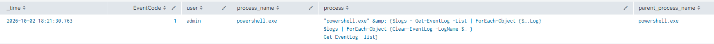
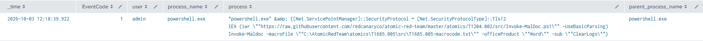

Event ID 104: Event Log Cleared
```spl
index=main
EventCode=104
| table _time host user EventCode source sourcetype Message
| sort - _time
```
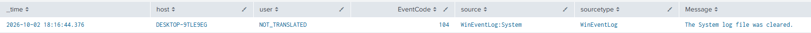
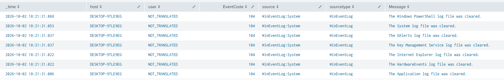
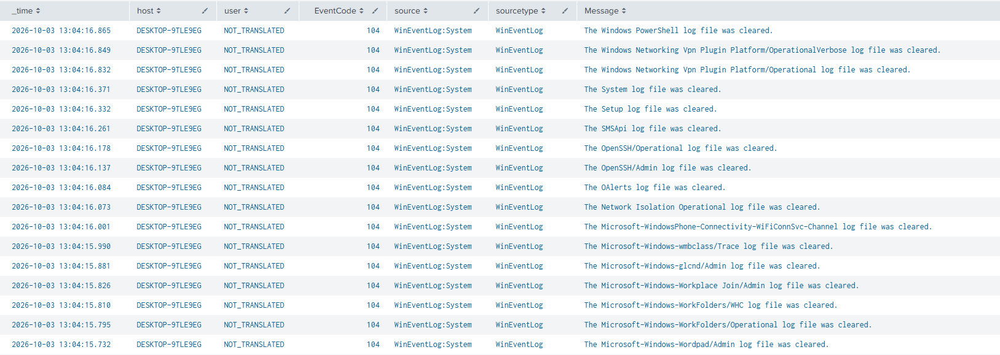

Event ID 1102: Audit Log was cleared
```spl
index=main
EventCode=1102
| table _time host user EventCode source sourcetype Message
| sort - _time
```
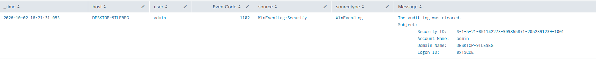
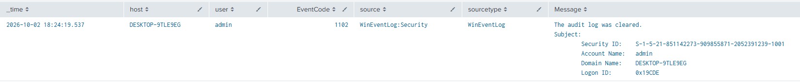
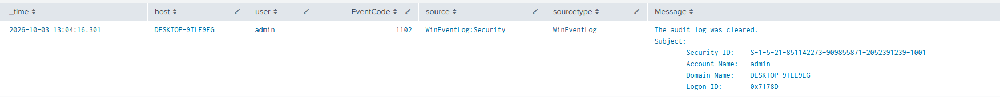

## References
- MITRE ATT&CK: https://attack.mitre.org/techniques/T1685/005/
- Atomic Red Team: https://www.atomicredteam.io/docs/atomics/T1685.005